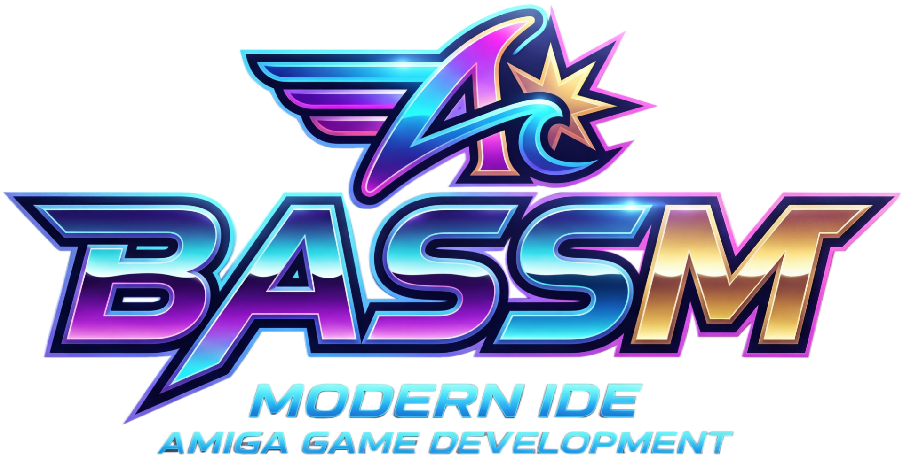

# BASSM — Blitz2D to Amiga m68k Assembler

A compiler and IDE that translates **Blitz2D**-style BASIC into native **Motorola 68000 assembly** for the Commodore Amiga, assembles and links it with **vasmm68k_mot + vlink**, and previews the result in the **vAmiga** WASM emulator — all inside a single Electron app.

Generated executables are standard **AmigaOS hunk binaries**, compatible with real Amiga hardware (OCS/ECS, KS 1.3+), WinUAE, vAmiga, and AROS. There is no runtime — every command compiles to inline m68k.

> **Documentation, tutorials, language reference:** [basm-amiga.com](https://basm-amiga.com)

---

## Early Access — Version 0.9.1

BASSM is in **Early Access**. The compiler, IDE and emulator preview are usable end-to-end, but expect rough edges, breaking changes between versions, and missing features. **Not production-ready** — please don't ship commercial games on this version yet, and back up your projects (the project format may change before 1.0).

### What works today

- **End-to-end pipeline:** Blitz2D source → m68k assembly → AmigaOS hunk executable, in one click. Output runs on real A500 (KS 1.3) and any later Amiga.
- **Full IDE:** Monaco-based code editor with syntax highlighting, autocomplete, and per-frame cycle / Chip-RAM budget bars.
- **Embedded asset editors:** Image (with palette quantisation), Tileset, Tilemap (with collision, tile types, slopes, animation), Sound, and Font.
- **Live preview** in the bundled vAmiga WASM emulator with mouse, keyboard and joystick input — no Kickstart ROM required (free AROS ROM bundled).
- **Language:** the Blitz2D-compatible subset listed below, including arrays, functions/procedures, constants, `Data`/`Read`/`Restore`, and inline collision built-ins.
- **OS-friendly exit:** programs return cleanly to Workbench/CLI; mouse, keyboard and Caps Lock are restored after exit.
- **ADF export:** generate bootable AmigaDOS floppy images directly from the IDE for use on real hardware or any emulator.

### Known limitations / not yet implemented

- **No smooth tilemap scrolling yet** — viewport + camera scrolling redraws the visible map per frame; the optimised ring-buffer/screen-blit path (PERF-J) is in the next milestone.
- **No music replay** — only PCM samples via `PlaySample`. ProTracker MOD support (`LoadMOD` / `PlayMOD`) is on the roadmap.
- **No pixel-perfect sprite collision** — sprite↔sprite tests are rectangle / image-bounds only. Tile collision (incl. slope-aware) is supported via `GetTileType` / `GetTileColl` / `CollideTile`.
- **Fonts are 8 pixels wide max** — variable-width fonts (5×5, 7×7, 10×10, 16×16) and the upcoming Topaz-256 built-in font are next.
- **No interleaved bitplanes** — bobs run one plane at a time; the 5× speedup from `PERF-G` is pending.
- **Single target system:** stock A500 / 512 KB Chip-RAM. Per-project target configuration (A1200, Fast-RAM, etc.) is planned but not yet exposed.
- **IDE colour swatches** in the editor are temporarily not rendering (BUG-8).
- **No WHDLoad export yet.**

### What "Early Access" means

- The language and command set are stable in spirit, but signatures may still change (we'll document migrations).
- Asset binary formats (`.iraw`, `.tset`, `.bmap`, `.bfnt`) may break between versions — re-export from the IDE editors after upgrading.
- Bugs are expected; please report them on the issue tracker with a minimal repro.
- Don't rely on BASSM for production work yet. Use it to prototype, learn, and tell us what's missing.

---

## What it does

Write code on the left, click **Run** to compile, assemble, link and boot it in the embedded Amiga emulator. No Amiga hardware required.

```basic
Graphics 320, 256, 3
PaletteColor 0, 0,0,0     ; black background
PaletteColor 1, 15,0,0    ; red box
ClsColor 0

x = 10 : y = 10 : dx = 3 : dy = 2

While 1
  Cls
  x = x + dx : y = y + dy
  If x < 0   Or x + 30 > 320 Then dx = -dx : EndIf
  If y < 0   Or y + 20 > 256 Then dy = -dy : EndIf
  Color 1 : Box x, y, 30, 20
  ScreenFlip
Wend
```

---

## Pipeline

`Source → Lexer → Parser → CodeGen → Peephole → vasmm68k_mot → vlink → .exe → vAmiga / WinUAE / real Amiga`

Four passes in JS produce m68k assembly with a peephole optimiser as the final pass; vasm + vlink produce a clean AmigaOS hunk executable that is also written to the project folder for transfer to a real Amiga.

---

## Running

Requires **Node.js** (LTS). Supported on **Windows** and **Linux**.

```bash
npm install
npm start
```

The free AROS ROM is bundled — no Kickstart file needed.

```bash
npm test            # compiler unit tests
```

---

## Workspace

On first launch BASSM creates `Documents/BASSM/` containing a read-only
mirror of the bundled examples (`examples/`), your editable projects
(`projects/`), and a settings file (`bassm.json`). The Welcome screen's
**Examples** list clones any example into `projects/` for editing —
the original mirror is untouched. Full layout, backup advice and
clone workflow: [basm-amiga.com/docs/workspace](https://basm-amiga.com/docs/workspace).

---

## Building a distributable

| Platform | Command | Output |
|---|---|---|
| Windows | `build-win.bat` | `dist/windows/BASSM-win-x64.exe` (portable) |
| Linux | `./build-linux.sh` | `dist/linux/BASSM-linux-x64.AppImage` |

Both scripts run `npm install` first. Linux AppImage needs `libfuse2`.

---

## Language

Blitz2D-compatible subset, integer-typed, with Amiga-aware extensions:

- **Drawing:** `Plot`, `Line`, `Rect`, `Box`, `Cls`, `Text`, `Color`, `PaletteColor`, `LoadFont` / `UseFont`
- **Tiles & scrolling:** `LoadTileset`, `LoadTilemap`, `DrawTilemap`, `SetTilemap`, `ChangeTile`, `SetCamera`, `SetViewport`, `Viewport`
- **Sprites:** `LoadImage`, `DrawImage`, `LoadAnimImage`, `LoadMask`, `SetBackground`, `DrawBob` (with auto background restore + masked draw)
- **Sound:** `LoadSample`, `PlaySample` (one-shot or looping), `StopSample` (Paula DMA)
- **Input:** `WaitKey`, `KeyDown`, `Joy*`, `MouseX/Y/Down/Hit`
- **Collision:** `RectsOverlap`, `ImagesOverlap`, `ImageRectOverlap`, `GetTileType`, `GetTileColl`, `CollideTile` (all inline; `CollideTile` is slope-aware)
- **Control flow:** `If/ElseIf/Else/EndIf`, `While/Wend`, `Repeat/Until`, `For/Next`, `Select/Case`, `Exit n`
- **Functions & procedures** with locals and parameters (Blitz2D `Function`/`EndFunction`, `Return`)
- **Types:** `Type … EndType` with `Field`, instance + array declarations (`Dim e.Enemy(n)`), `\` field accessor
- **Arrays:** `Dim arr(d0, d1, …)`, N-dimensional
- **Constants & data:** `Const`, `Data` / `Read` / `Restore`
- **Math:** `+ - * /`, `Mod`, `Shl`, `Shr`, `And`, `Or`, `Xor`, `Not`; built-ins `Rnd`, `Abs`, `Str$`
- **Timing:** `WaitVbl`, `Delay`
- **Hardware:** `PeekB/W/L`, `PokeB/W/L`, `CopperColor` for raster bars
- **Code organisation:** `Include "file.bassm"`

Full reference with signatures, examples and gotchas: [basm-amiga.com/docs](https://basm-amiga.com).

---

## Targets

OCS/ECS Amiga · PAL · 68000 · Kickstart 1.3+. The IDE reports cycle and chip-RAM budgets per frame so programs stay within real hardware constraints.

---

## License

MIT — see `package.json`.
